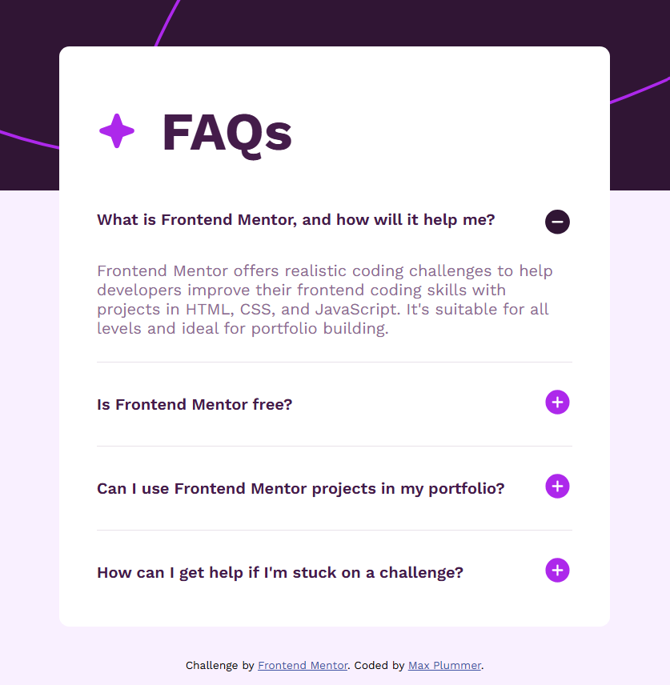

# Frontend Mentor - FAQ accordion solution

This is a solution to the [FAQ accordion challenge on Frontend Mentor](https://www.frontendmentor.io/challenges/faq-accordion-wyfFdeBwBz).

## Table of contents

- [Overview](#overview)
  - [The challenge](#the-challenge)
  - [Screenshot](#screenshot)
  - [Links](#links)
- [My process](#my-process)
  - [Built with](#built-with)
  - [What I learned](#what-i-learned)
  - [Useful resources](#useful-resources)
- [Author](#author)

## Overview

### The challenge

Users should be able to:

- Hide/Show the answer to a question when the question is clicked
- Navigate the questions and hide/show answers using keyboard navigation alone
- View the optimal layout for the interface depending on their device's screen size
- See hover and focus states for all interactive elements on the page

### Screenshot



### Links

- Solution URL: https://github.com/MaxPlummer/faq-accordion
- Live Site URL: https://maxplummer.github.io/faq-accordion/

## My process

### Built with

- Semantic HTML5 markup
- CSS classes
- Flexbox
- Mobile-first workflow
- JavaScript

### What I learned

I learned more about accessibility features using aria attributes and updating them with JavaScript. 
```html
<button
  type="button"
  class="accordion"
  aria-expanded="false"
  aria-controls="faq-1"
```
I gained a bit of experience using JavaScript to create an interactive page by adding event listeners to manipulate elements and styles. 
```js
accordions[i].addEventListener("click", function () {
  this.classList.toggle("active");
```

### Useful resources

- [W3Schools Accordion](https://www.w3schools.com/howto/howto_js_accordion.asp) - I chose to make a customized accordion setup with buttons and JavaScript. This page gives an exact tutorial on how to create the base functionality of that. 
- [W3Schools Transitions](https://www.w3schools.com/css/css3_transitions.asp) - This is another page from W3Schools talking about transitions. I used collapsing and fading transitions for the accordion, and this page helped me understand the mechanics and syntax involved in creating those transitions. 

## Author

- GitHub - [MaxPlummer](https://github.com/MaxPlummer)
- Frontend Mentor - [@MaxPlummer](https://www.frontendmentor.io/profile/MaxPlummer)
- LinkedIn - [Maxwell Plummer](https://www.linkedin.com/in/maxwell-plummer-1b2b13291/)
